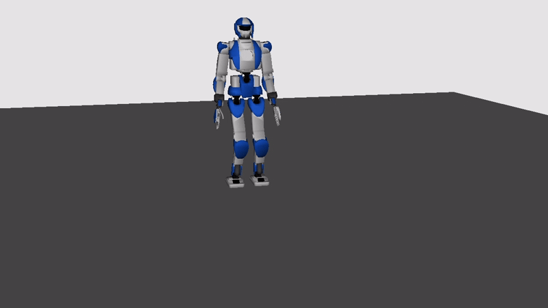

# Trajectory Optimization for Humanoids via Centroidal Dynamics 

<p align="center">
  
</p>

## Project Description
This repository contains the implementation of a trajectory optimization framework for humanoid robots based on Stiffness-Based Centroidal Dynamics (SBCD).
The project builds upon the work by Tazaki et al. (2024) and aims to reproduce and evaluate closed-form centroidal dynamics for standing and walking tasks.

The core idea is to parametrize contact wrenches through stiffness-like variables, allowing:
- closed-form integration of centroidal dynamics,
- long-horizon trajectory optimization,
- reduced computational complexity compared to full-body models.

The framework is implemented in Python and validated in simulation using the HRP-4 humanoid robot model.


## Repository Structure 
```
AMR-FP1-centroidal_dyn-main/
├── meshes/                            # .dae files defining robot visualization
├── urdf/                              # .urdf files defining ground and robot  
├── report/                            # LaTeX report files
├── outputs/                           # .txt files containing TO solutions 
├── plots/                             # .png files containing TO solutions
├── foot_trajectory_generatory.py      # Foot trajectory reference generator
├── footstep_planner.py                # Contact sequence and step planning
├── graphics.py                        # Visualization plots 
├── main.py                            # Main  
├── sbcdyn.py                          # Stiffness Based Centroidal Dynamics Formulas Definition  
├── simulation.py                      # Visualization of Robot TO Solution  
├── trajectory_generation.py           # Reference Trajectory Generator
└── utils.py                           # Utility functions 
```


## Proposed Method
The method is based on Stiffness-Based Centroidal Dynamics (SBCD), a reduced-order model describing the motion of the robot’s Center of Mass (CoM) and angular momentum.

Key elements:
- Centroidal dynamics expressed in terms of total external wrench.
- Spring-like parametrization of contact wrenches, where each contact is modeled using:
  - a stiffness parameter,
  - a virtual pivot point (CMP-like),
  - an optional pure moment term.
- Closed-form analytical solutions for CoM position, velocity, and angular momentum over each contact phase using zero-order hold.
- Discrete-time formulation suitable for trajectory optimization.
- Quaternion-based integration of the base-link orientation.

This formulation allows the dynamics to be integrated analytically within each contact phase, significantly reducing the number of optimization variables while maintaining physical consistency.

## Trajectory Optimization
The planning problem is formulated as a finite-horizon optimal control problem, where:
- State variables include:
  - CoM position and velocity,
  - Base orientation and angular momentum,
  - End-effector positions and orientations,
  - Time.

- Control inputs include:
  - Phase duration,
  - End-effector linear and angular velocities,
  - Contact stiffness parameters,
  - CMP offsets and moment terms.


The total cost function is composed of:
- Task-related cost: tracking reference trajectories for CoM, feet, and base.
- Limit-related cost: inequality constraints handled via log-barrier functions (friction cones, CoP bounds, stiffness limits, phase duration bounds).
- Contact-dependent cost: enforces physical consistency between contact states, velocities, and stiffness values.

The optimization problem is solved using CasADi + IPOPT.

## Tasks Implemented 
1. Still Task:
   - Both feet remain in contact with the ground.
   - Objective: maintain a stable posture while compensating gravity.
   - Used to validate balance and force distribution.

2. Walking Task:
   - Alternating single-support and double-support phases.
   - Predefined contact sequence and footstep plan.
   - CoM and foot trajectories generated to produce forward locomotion with lateral sway and vertical motion.


## Results 
Simulation results show that:
- The robot successfully maintains balance during the still task with stable CoM and angular momentum.
- During walking, the optimized trajectories reproduce realistic CoM motion, foot swing phases, and contact forces.
- Contact wrenches satisfy friction and moment constraints.
- The framework produces physically consistent motions with relatively low computational cost.

Plots and numerical results are stored in the plots/ and outputs/ folders.


# Installation
You need a Python installation and some dependencis. If using PIP, you can run the following
```
pip install dartpy casadi scipy matplotlib osqp
```
You need dartpy 0.2 : If pip does not allow you to install this version on your system, you might want to use conda

To run the simulation, choose one of the following tasks 
- **still**, to simulate a fixed robot
- **walking**, to simulate a walking robot
```
python main.py [task] --make_video
```
if you want to save the video (more time)
or
```
python main.py [task] 
```

Then, to see the robot simulation in Dartpy, run
```
python simulation.py
```


## Acknowledgments
* The original paper:

```bib
@article{tazaki2024trajectory,
  title={Trajectory generation for legged robots based on a closed-form solution of centroidal dynamics},
  author={Tazaki, Yuichi},
  journal={IEEE Robotics and Automation Letters},
  year={2024},
  publisher={IEEE}
}
```

* Other Related Works : 

```bib
@article{scianca2020mpc,
  title={MPC for humanoid gait generation: Stability and feasibility},
  author={Scianca, Nicola and De Simone, Daniele and Lanari, Leonardo and Oriolo, Giuseppe},
  journal={IEEE Transactions on Robotics},
  volume={36},
  number={4},
  pages={1171--1188},
  year={2020},
  publisher={IEEE}
}
```

```bib
@article{cipriano2023humanoid,
  title={Humanoid motion generation in a world of stairs},
  author={Cipriano, Michele and Ferrari, Paolo and Scianca, Nicola and Lanari, Leonardo and Oriolo, Giuseppe},
  journal={Robotics and Autonomous Systems},
  volume={168},
  pages={104495},
  year={2023},
  publisher={Elsevier}
}
```

